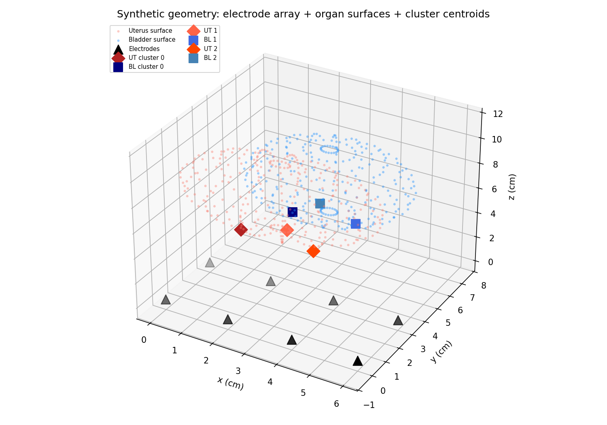
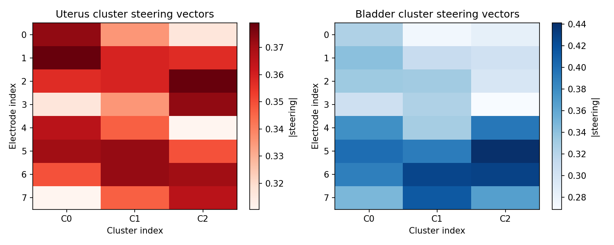
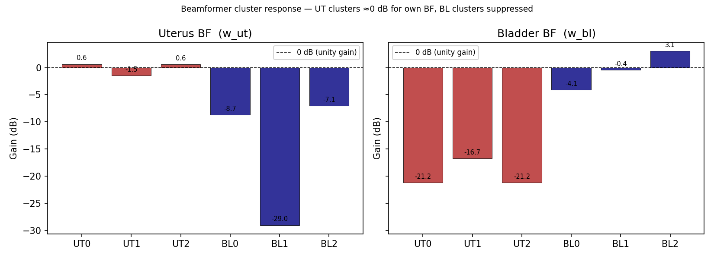
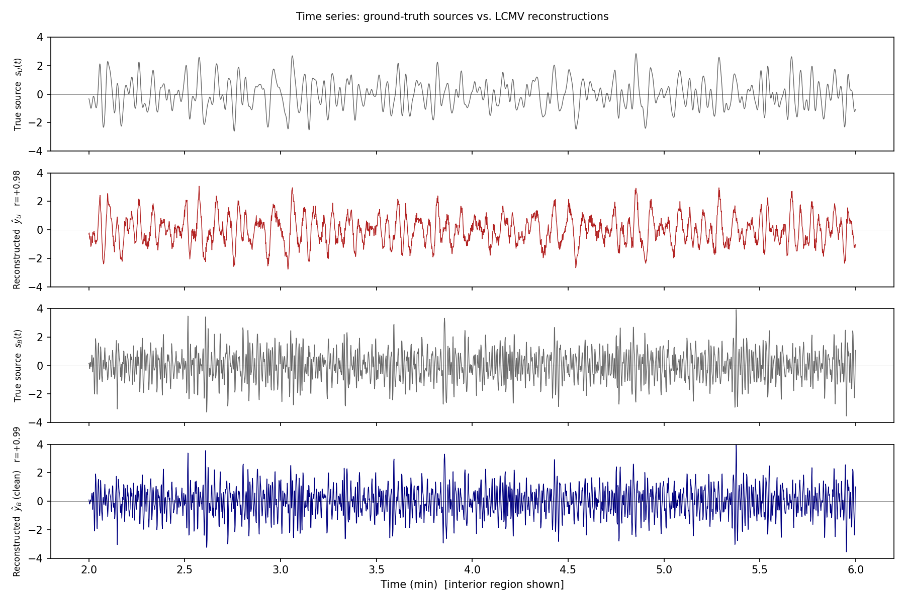
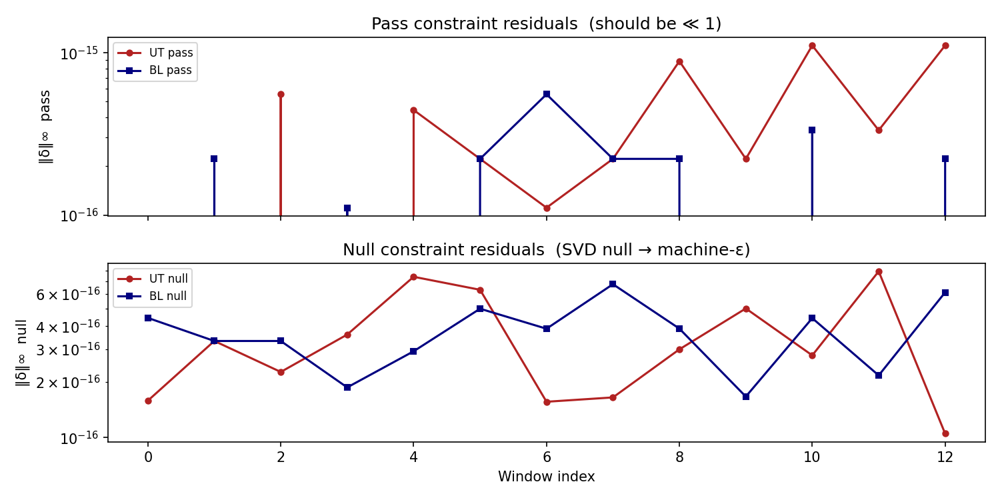
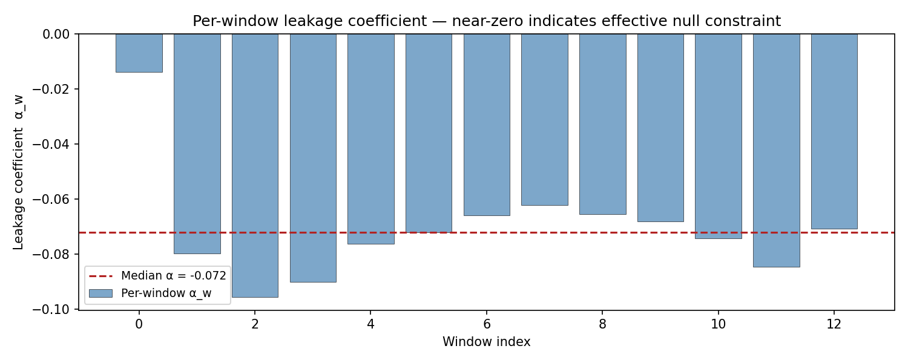
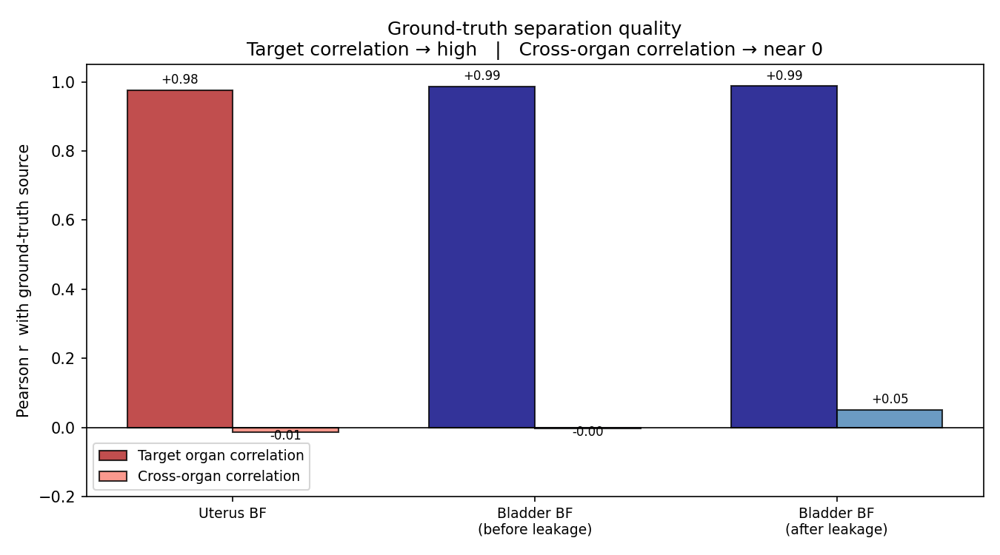

# mcLCMV — Anatomy-guided multicluster LCMV beamforming for EHG-MRI

Code repository for the paper:

> **Disentangling uterine and bladder activity in paired EHG-MRI data using anatomy-guided multicluster beamforming**  
> M. C. Bustos-Vivas, S. Tripathy, J. Aviles Verdera, N. Alves de Castro, J. Hutter  
> MICCAI 2026

---

## Overview

The pipeline separates uterine and bladder electrical activity recorded with a synchronized 8-channel abdominal EHG array and simultaneous T1-weighted MRI. MRI-derived 3D organ segmentations provide subject-specific steering dictionaries. A windowed dual LCMV beamformer with organ-specific pass and null constraints, Bayesian covariance shrinkage, and overlap-add reconstruction produces organ-resolved time series.

```
Stage 01  scripts/01_preprocess.py    MRI surface extraction + EHG trimming
Stage 02  scripts/02_lcmv.py          Windowed dual LCMV beamformer
Stage 03  scripts/03_results_table.py Results table
```

## Installation

```bash
git clone https://github.com/CamilaBustos258/mcLCMV_EHG_MRI.git
cd mcLCMV_EHG_MRI
pip install -e ".[dev]"
```

Requires Python ≥ 3.11.

## Data

Participant data are not included in this repository. Raw EHG and MRI files must be placed in a BIDS-organised `sourcedata/` folder:

```
sourcedata/
└── sub-XX/
    └── ses-YYYYMMDD/
        ├── mri/   (T1w.nii.gz, label-uterus_mask.nii.gz,
        │           label-bladder_mask.nii.gz, label-electrodes_mask.nii.gz)
        └── ehg/   (*.vhdr, *.vmrk, *.eeg)
```

Point the pipeline to your sourcedata folder by setting the environment variable before running any script:

```bash
export MCLCMV_SOURCEDATA=/path/to/your/sourcedata
```

If the variable is not set, the pipeline defaults to `data/sourcedata/` inside the project tree.

## Usage

```bash
# Preprocess one session
python scripts/01_preprocess.py --subject sub-06 --session ses-20250828

# Run LCMV beamformer
python scripts/02_lcmv.py --subject sub-06 --session ses-20250828

# Print results table (all processed sessions)
python scripts/03_results_table.py
```

Add `--all` to process every session registered in `config/orientation_registry.json`.

## Demo

Run the self-contained synthetic demo to verify the pipeline without any participant data:

```bash
python scripts/00_demo.py
```

The script generates two synthetic sources — a slow uterine-like oscillation and a faster
bladder-like signal — mixed through anatomically plausible steering vectors, then applies
the full windowed LCMV pipeline and saves 7 figures to `data/demo/figures/`.

### Expected outputs

**Geometry and steering vectors**

The electrode array (triangles), organ surfaces, and DOA cluster centroids.
The mean separation angle between uterus and bladder clusters is ~30°.



Heatmap of the K=3 cluster steering vectors per organ (rows = electrodes, columns = clusters).
The bladder vectors are more uniform across electrodes (shallower, more anterior organ).



**Beamformer response**

Gain (dB) of each beamformer on every cluster centroid.
The uterus beamformer (left) achieves ~0 dB on its own clusters and strong suppression
on the bladder clusters; the bladder beamformer (right) is the mirror image.



**Time series**

Ground-truth sources (grey) overlaid with LCMV reconstructions (colour).
The Pearson correlation r with the true source is shown in each label.



**Constraint residuals**

Pass and null constraint residuals per window, both at machine precision (~10⁻¹⁶).
This confirms the LCMV weights satisfy C^H w = f exactly every window.



**Leakage coefficient**

Per-window scalar leakage coefficient α between the bladder and uterus outputs.
The near-zero median (SVD null spans 99.999 % of the opposing organ direction)
shows the null constraint leaves minimal uterus residual in the bladder channel.



**Separation quality summary**

Pearson r of each beamformer output with both ground-truth sources.
Target-organ bars (dark) should be close to +1; cross-organ bars (light) should be near 0.



---

## Tests

```bash
pytest
```

All unit tests run without any data files.

## License

MIT — see `LICENSE`.

## Citation

If you use this code, please cite:

```bibtex
@inproceedings{bustosvivas2026mclcmv,
  title     = {Disentangling uterine and bladder activity in paired {EHG-MRI}
               data using anatomy-guided multicluster beamforming},
  author    = {Bustos-Vivas, Maria Camila and Tripathy, Smiti and
               Aviles Verdera, Jordina and Alves de Castro, Nyvenn and
               Hutter, Jana},
  booktitle = {Medical Image Computing and Computer Assisted Intervention -- MICCAI 2026},
  year      = {2026}
}
```
